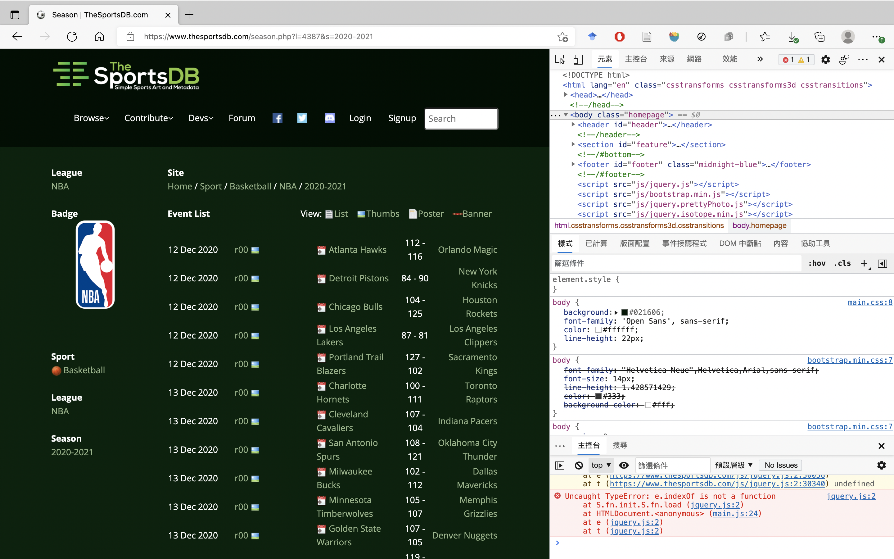
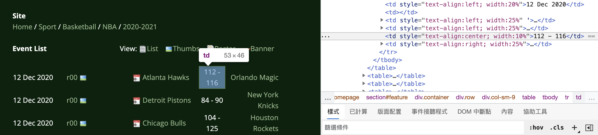
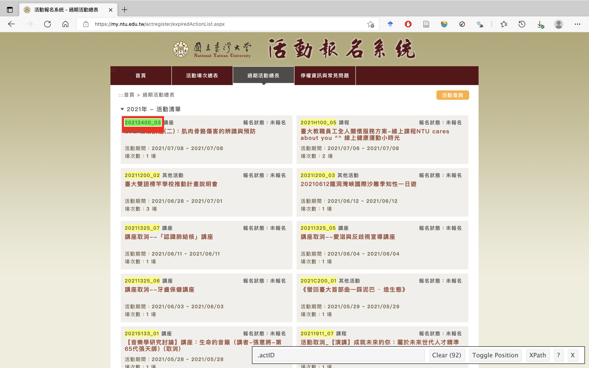
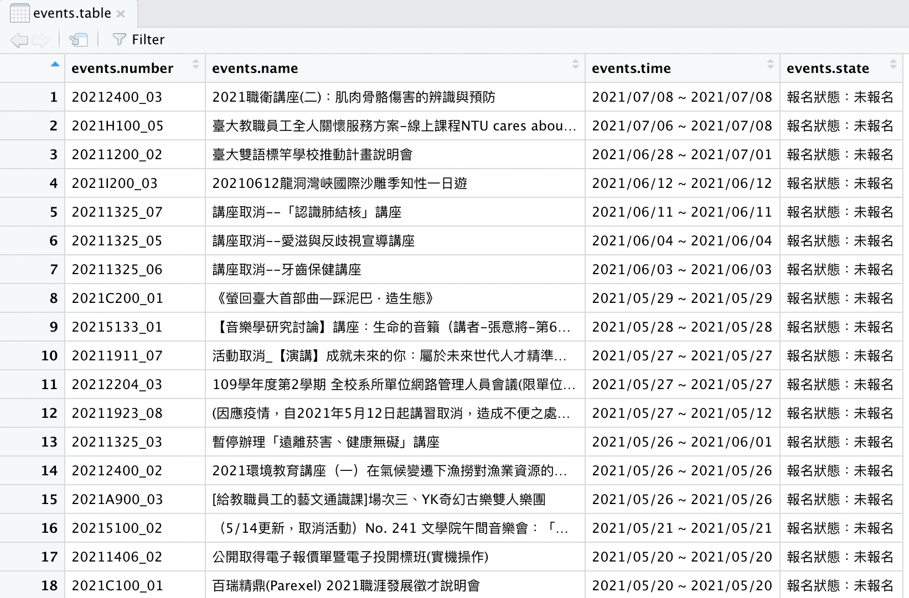

# (PART) 資料庫與基本的資料前處理 {-}

# R 的資料庫 {#rdata}

::: {.note}
本章為 @zamorasaizIntroductionDataAnalysis2020 節 3.1 與 3.2 內容。
:::

## 資料來源、匯入與匯出

### Tabulated File Types

最簡單的表格檔就是每個 column 的資料由空格分開，而每個 row 的資料由換行分開。這種分隔符號（separator）方便卻有一個大問題，即兩個字的資訊無法儲存，例如 orange shirt 就會變成兩塊。

所以要解決這個問題，就是每個 column 的資料改由逗號分開。不過想當然耳，如果資料內有逗號，那儲存上也會出現問題。如果想解決這個問題，也能用分號分開每個 column。雖然使用到分號的機率低上許多，但還是沒辦法免於這種風險。所以說，分隔好的選擇其實沒有什麼放諸四海皆準的通則，只能多加注意。

表格檔可以儲存種許多種檔案格式，最常見的是 *comma separated values format*，即 `.csv` 檔。雖然它是如此稱呼，但我們在匯入與匯出資料時也都要敘明 seperator。

### 匯入與匯出

#### `.csv` 檔

要匯入 `.csv` 檔可以使用 `read.csv()`。其有多個引數，最重要的是以下的四個。

```{r eval=FALSE}
our.table <- read.csv("myfilewithdata.csv", header=TRUE, sep=";", dec=".")
```

第一個引數指定要從哪裡讀取資料；第二個引數決定表格有無 header；第三個引數指定 separator 而第四個引數指定 decimal separator。

而以 `write.csv()` 可以匯出 data frames 成 `.csv` 檔。第一個引數指定要輸出的 data frames；第二個引數指定輸出的名稱；第三個與第四個引數分別指定有無包含 coloumn 與 row 的名字；第五個與第六個引數分別指定 separator 與 decimal separator。

```{r eval=FALSE}
write.csv(our.table, "filetosave.csv", col.names=FALSE, row.names=TRUE, sep=";", dec=".")
```

除了 `.csv` 檔也還有其他資料類型，如 `.txt` 與 `.dat` 檔，分別可以 `read.table()` 與 `read.delim()` 讀取。不過，我們要匯出資料時最好還是匯出為 `.csv` 檔，因為它最通用。

但要注意的是，前開的 `read.csv()` 與 `write.csv()` 處理起大數據速度很慢。我們可以使用一個 R package `data.table` 來解決這個問題，只要在 console 輸入：`library(data.table)`，^[Mac OS Big Sur 與搭載 ARM 64 處理器的蘋果電腦用戶可參考[此文](https://www.ptt.cc/bbs/R_Language/M.1626724798.A.3C7.html)，以安裝 OpenMP，發揮 `data.table` 的完整效能。]並分別以 `fread()` 與 `fwrite()` 來讀取與輸出檔案，其中 `f` 為 "fast" 之義。除了處理速度大增，使用 `fread()` 與 `fwrite()` 還可以讀取 `.csv` 檔以外的檔案，也可以自動識別 separator，而資料將會開啟成 `data.table` 的型態（`data.frame` 的升級版），而非 `data.frame`。

#### `.json` 檔

除了表格檔，我們還會需要使用**階層檔（hierarchical files）**。標準的階層檔檔案格式為 *JavaScript Object Notation*，即 `.json` 檔，就像書目一樣儲存資訊。但我們要讀取這類的檔案無法直接為之，必須借助套件 `jsonlite`。想要匯入一個 `.json` 檔到 R 裡頭並轉成 data.frame 格式只要輸入：

```{r eval=FALSE}
library(jsonlite)
jsonastable <- as.data.frame(fromJSON("ourjsonfile.json"))
```

#### `.xls` 與`.xlsx` 檔

除外，還有一種檔案格式為**試算表（spreadsheets）**。MS Excel 就是最受歡迎的試算表程式。試算表雖然在某些領域頗有用，但也有計算速度與檔案大小的限制：Excel 檔最多只能有 1,048,576 個 rows 與 16,384 個 columns。想要在 R 載入 Excel 檔（`.xls` 或 `.xlsx` 檔），可以使用套件 `readxl`。輸入：

```{r eval=FALSE}
library(readxl)
data <- read_excel("file.xlsx", col_names=TRUE, col_types=c("numeric", "numeric"), sheet=2)
```

引數 `col_types` 指定每個 column 裡的資料型態，而引數 `sheet` 則選擇要匯入檔案中的哪張試算表。


## 資料收集

資料依據其結構化的程度分成：

-  **Fully Structured:** 變數已經明確定義而為表格的形式的 datasets。不費吹灰之力就能轉換成 data frames。使用 APIs 或一些公開的資料來源可以取得此類型的資料。
 
-  **Semi Structured:** 變數也已經明確定義，但還沒有變成表格的形式，例如網頁。還需要經前處理。

-  **Unstructured:** 變數尚未明確定義，例如圖片、音樂或未經處理的文字。需要先經過其他前處理，才能轉換成可供分析的資料。

處理非結構化的資料需要足夠的數學基礎，此處將會專於前兩者。

### Data Repositories

存取資料最簡單的方式是使用免費公開的資料庫，如 The World Data Bank、Eurostat、U.S. Government’s Open Data 等，或者其他商用的資料庫。此外，也有套件 `mlbench`，包含了 UCI Machine Learning Repository 的 datasets。如果要載入 `Glass` dataset，只要輸入：

```{r eval=FALSE}
library(mlbench)
data(Glass)
```

### APIs

**Application Programming Interfaces (APIs)** 使我們可以直接存取資訊，而不需要透過手動下載 datasets 的方式。APIs 是一種通訊協定（communication protocols），有清楚的結構，可以有效率的傳遞資訊。此外，還可以如果有需要限制下載量，或者確認憑證（credentials），或者分割過大的檔案。

#### REST APIs

APIs 都會有文件說明如何使用，有些要以特定的程式語言才能存取，例如 Python 或 PHP。最常見的 APIs 為 **Representational State Transfer APIs (REST APIs)**，其透過 URLs 要求資料，而提供的資料都會是標準的結構化格式（standard structured formats）。

因為每個 REST API 組織用以存取資料的 URLs 的方式都不同，所以使用 REST APIs 前得要先閱讀文件，了解如何存取想要的文件，然後再透過 R 存取之，若有需要並將其轉換成 data frames。

#### OpenSky Network Example

OpenSky Network 為一非營利組織，其透過 REST API 分享資料，旨在增進航空交通的安全與效率。我們要獲取當下的航班的狀態。第一步是閱讀其[文件](https://opensky-network.org/apidoc/rest.html)。因為其提供的文檔是 `.json` 檔，所以我們要載入 `jsonlite`：

```{r}
library(jsonlite)
```

然後透過所提供的 URL，請求檔案，並轉成 data frame：

```{r eval=FALSE}
url <- "https://opensky-network.org/api/states/all"
flights <- as.data.table(fromJSON(URLencode(url)))
```

第一行把 URL 指派給字串 `url`；而第二行中，`fromJSON()` 可以讀取 `.json` 檔，`URLenconde()` 則是要告訴 R，將要放進一個有 `.json` 檔的 URL，其說明可在 Console 輸入 `?URLencode` 了解，然後以 `as.data.frame()` 將資料轉成 data frame，並存進變數 `flights` 中（也可以 `as.data.table()` 把資料轉成 data table 的型態）

另一方面，如果 APIs 提供的檔案是 `.csv` 檔，那我們可以直接使用 `fread(URLencode(指定的url))`，而毋需使用 `jsonlite`。


### Web Scraping {#rvestweb}

::: {.caution}
至今，已有 `rvest` 已有更新，可見 https://www.tidyverse.org/blog/2021/03/rvest-1-0-0/。
:::


從網頁抓取資料時，一般的流程為：

1.  清楚定義要下載的資訊為何。
2.  了解網頁的編碼方式。
3.  以 R 選擇並下載之。
4.  將其轉換為變數並組合成 data frame。

以下以兩個例子說明網頁抓取的流程。

#### TheSportsDB

>  雖說這個網頁有 API，但此僅作為範例。

每個網頁都有一個 `robots.txt`，在瀏覽器的網址列輸入 `目標網頁/robots.txt` 可以查看。以此處的 TheSportsDB 為例，即輸入 https://www.thesportsdb.com/robots.txt 就能查看之。其記載著：

```
User-agent: *
Disallow:
User-agent: AhrefsBot
Disallow: /
```

我們先從其第三、四行開始閱讀，其意指機器人 AhrefsBot 被禁止從網頁抓取任何東西，其中 `/` 為「任何東西」之義，`Disallow: /` 即禁止抓取任何東西。第一、二行則表示所有既存的機器人（表示為 `*`）沒有禁止，即存取是合法的。

我們想抓取的網頁是[https://www.thesportsdb.com/season.php?l=4387&s=2020-2021](https://www.thesportsdb.com/season.php?l=4387&s=2020-2021)，即 NBA 2020--2021 年的球賽。多數的網頁是由 **HyperText Markup Language (HTML)** 編碼的。當我們連到上述的網頁，按下鍵盤 `F12`，並選取「元素」（Elements）的頁面標籤，可以開啟如圖 \@ref(fig:webscraping) 的畫面。

```{r webscraping, fig.align = 'center', echo=FALSE, out.width="650pt", fig.cap="Inspection menu."}

```

在 `.html` 檔中，所有元素的首尾都有一個 tag，即以 `<tag>` 為開頭（可能會包含屬性，如 `<tag attribute=value>`），而以 `</tag>` 結尾。

在該網頁中，如圖 \@ref(fig:tabletd)，當我們把游標放到第一場球賽的結果時，右欄 `<td style="text-align:center; width:10%">112 - 116</td>` 也會被強調。在這個 tag 中，描述了文字的對齊方式與要呈現哪些文字在螢幕上。

```{r tabletd, fig.align = 'center', echo=FALSE, out.width="650pt", fig.cap="第一場比賽的比分所對應到的程式碼。"}

```

了解我們所要的資訊所對應到的程式碼是哪部分以後，下一個步驟是用 R 打開網頁，並告訴它要存取哪部分的資料。接下來的流程是：

1.  呼叫網頁，並將其存在變數中。
2.  指定要抓取的部分。
3.  轉換資訊成文字。

首先使用套件 `rvest`，用以擷取網頁資料。在 Console 輸入：

```{r}
library(rvest)
```

並以指令 `read_html()` 呼叫網頁，將其儲存在變數中，如：

```{r eval=FALSE}
nbagames <- read_html("https://www.thesportsdb.com/season.php?l=4387&s=2020-2021")
```

輸入 `nbagames` 我們可以看到：

```
{html_document}
<html>
[1] <head>\n<meta http-equiv="Content-Type" content="text/html; charset=UTF-8">\n<script type="text/ja ...
[2] <body class="homepage">\n\n<header id="header"><nav class="navbar navbar-inverse" role="banner"><d ...
```

而我們可以利用 `html_nodes()` 指定要抓取的部分。此函數需要兩個引數，其一為網頁（剛剛把網頁存到的變數就要放在這裡），其二為我們所需要的 tag 的字串，因為我們需要 `<td>` 這個 tag，所以在這裡即輸入 `"td"`，如：

```{r eval=FALSE}
games <- html_nodes(nbagames,"td")
```

此時，變數 `games` 儲存了：

```
{xml_nodeset (7327)}
 [1] <td><br></td>\n
 [2] <td style="text-align:left; width:20%">12 Dec 2020</td>\n
 [3] <td></td>\n
...
```

由此可見，匯入了所有 td tags，而儲存於 `xml_nodeset`，一種專為與 `.html` 互動而設計的資料型態。因為要轉換成 `character` 才能處理，所以我們要使用 `html_text()`，如：

```{r eval=FALSE}
games <- html_text(html_nodes(nbagames, "td"))
```

此時，`games` 內儲存的就會是：

```
[1] ""                         "12 Dec 2020"              ""                        
[4] "\n\t\t\t\t\n\t\t\t\tr00 " "Atlanta Hawks"            "112 - 116"               
[7] " Orlando Magic"           "12 Dec 2020"              ""                        
[10] "\n\t\t\t\t\n\t\t\t\tr00 " "Detroit Pistons"          "84 - 90"                 
[13] " New York Knicks"         "12 Dec 2020"              ""        
...
```

可以發現，此時還是有一些空字串與 `\n`（換新行）、`\t`（表格）與 `\tr00` 之類的字元。我們接下來的目標是把資訊拆開，存入不同的變數中。待到節 \@ref(preprocessing) 將會處理這些問題。

#### Goodreads {#goodreads}

第二個任務是 Goodreads 網頁所列的 21 世紀最佳書籍，可以參見：[https://www.goodreads.com/list/show/7.Best_Books_of_the_21st_Century](https://www.goodreads.com/list/show/7.Best_Books_of_the_21st_Century)。首先當然是查看 `robots.txt`。因此我們要連到 [https://www.goodreads.com/robots.txt](https://www.goodreads.com/robots.txt)，可以發現有一大堆的 `Disallow`：

```
# See http://www.robotstxt.org/robotstxt.html for documentation on how to use the robots.txt file
User-agent: *
Disallow: /about/team_member/
Disallow: /admin
Disallow: /api
Disallow: /blog/list_rss
Disallow: /book/reviews/
Disallow: /book_link/follow/
...
```

但並非什麼存取都是不被允許的（因為 `/` 沒有被 `Disallow`），且 `/list/` 也沒有被 `Disallow`，所以還是可以抓取此網頁。而我們可以發現，第一本書的標題所對應的 `.html` 碼為 `<span itemprop="name" role="heading" aria-level="4">Harry Potter and the Deathly Hallows (Harry Potter, #7)</span>`，而 `span` 這個 tag 就是對應到書名。因此我們似乎可以仿效之前的做法：

```{r eval=FALSE}
goodreadsurl <- "https://www.goodreads.com/list/show/7.Best_Books_of_the_21st_Century"
goodreads <- read_html(goodreadsurl)
books <- html_text(html_nodes(goodreads, "span"))
```

但我們將會發現，存進 `books` 的卻是：

```
 [1] "Browse ▾"                                                          
 [2] "Community ▾"                                                       
 [3] ""                                                                  
 [4] ""                                                                  
 [5] ""                                                                  
 [6] ""                                                                  
 [7] "Profile"                                                           
 [8] "Groups"                                                            
 [9] "Groups"                                                            
[10] "Friends’ recommendations"                                          
[11] "Friends’ recommendations"                                          
[12] "Browse ▾"                                                          
[13] "Community ▾"                                                       
[14] "Harry Potter and the Deathly Hallows (Harry Potter, #7)"      
...
```

直到第 14 個元素，才抓到第一本書的書名。現在的問題就在，tag `span` 雖然有包含書名，但還有包含許多其他的資訊。要解決這個問題，我們可以發現 tag `span` 是在 tag `a` 的下層，而 tag `a` 有一屬性為 `class="bookTitle"`。Class 在 HTML 中的用處就是用來分類 tags 的方式，所以我們可以有單一個 tag，但有不同種類的資訊。因此，我們可以把剛剛的程式碼改成：

```{r eval=FALSE}
goodreadsurl <- "https://www.goodreads.com/list/show/7.Best_Books_of_the_21st_Century"
goodreads <- read_html(goodreadsurl)
books <- html_text(html_nodes(goodreads, ".bookTitle span"))
```

指涉 class 的時候，前面要加上 `.`，而我們可以在該引數中同時放入 classes 和 tags。上述的程式碼即選取所有有 class 為 `bookTitle` 的 nodes，而選取裡頭的 tag `span`。結果，`books` 會是：

```
  [1] "Harry Potter and the Deathly Hallows (Harry Potter, #7)"                     
  [2] "The Hunger Games (The Hunger Games, #1)"                                     
  [3] "The Kite Runner"                                                             
  [4] "The Book Thief"                                                              
  [5] "Harry Potter and the Half-Blood Prince (Harry Potter, #6)"                   
  [6] "Harry Potter and the Order of the Phoenix (Harry Potter, #5)"                
  [7] "The Help"    
...
```

顯然，結果就正常許多。而我們也需要提取作者與評分的資訊，因此程式碼為：

```{r eval=FALSE}
goodreads <- read_html(goodreadsurl)
book <- html_text(html_nodes(goodreads, ".bookTitle span"))
author <- html_text(html_nodes(goodreads, ".authorName span"))
rating <- html_text(html_nodes(goodreads, ".minirating"))
topbooks <- data.frame(book, author, rating)
```

這時候算是大致完成了，但評分的部分的格式還是不太行，有些多餘的 hyphen 或字詞，在節 \@ref(preprocessing)，將會處理這個問題。

#### 臺大活動報名系統與 CSS 選擇器

想要找出網頁的 CSS 選擇器路徑，除了上述手動查看的方法以外，如果使用 Google chrome 系列的瀏覽器，更方便的做法是使用如 [SelectorGadget](https://chrome.google.com/webstore/detail/selectorgadget/mhjhnkcfbdhnjickkkdbjoemdmbfginb?hl=zh-TW) 之類的外掛。安裝完成並開啟以後直接用滑鼠點選想要抓取的元素即可，如圖 \@ref(fig:ntuevents)。而如果包含到不想要選取的元素，就點選使其變成紅色，未包含到想要選取的元素則亦再行點選之即可。之後，SelectorGadge 將會產生一組 CSS 選擇器。如我們要抓取活動的代碼，其 CSS 選擇器即 `.actID`。

```{r ntuevents, fig.align = 'center', echo=FALSE, out.width="650pt", fig.cap="使用 SelectorGadget。"}

```

因此，我們可以如此抓取臺大活動系統之過期活動中 2021 年的活動清單，並製作成一張 data table：

```{r eval=FALSE}
events.url <- "https://my.ntu.edu.tw/actregister/expiredActionList.aspx"
events <- read_html(events.url)
events.number <- html_text(html_nodes(events, ".actID"))
events.name <- html_text(html_nodes(events, ".multiline"))
events.time <- html_text(html_nodes(events, ".actTime"))
events.state <- html_text(html_nodes(events, "#ulbox .floatRight"))
events.table <- data.table(events.number, events.name, events.time, events.state)
```

結果如圖 \@ref(fig:ntueventstable)。

```{r ntueventstable, fig.align = 'center', echo=FALSE, out.width="650pt", fig.cap="抓取臺大活動系統中 2021 年的過期活動的資訊。"}

```

#### 臺大政治系專任教師資料簡表

```{r cache=TRUE}
library(data.table)
polisci.prof.url <- "http://politics.ntu.edu.tw/?cat=8"
polisci.prof <- read_html(polisci.prof.url)
prof.name <- html_text(html_nodes(polisci.prof, ".name a"))
prof.title <- html_text(html_nodes(polisci.prof, ".title"))
prof.phone <- html_text(html_nodes(polisci.prof, ".tel"))
prof.email <- html_text(html_nodes(polisci.prof, ".mail a"))
prof.table <- data.table(prof.name, prof.title, prof.email)
prof.phone <- append(prof.phone, NA, 13)  # 蕭高彥沒有放電話
prof.table <- cbind(prof.table, as.data.table(prof.phone))
```


```{r}
knitr::kable(prof.table, booktabs = TRUE, caption = '臺大政治系專任教師資料簡表。')
```


## 小結

此外，還有兩個抓取網頁上的困難，此處沒有提及：

1.  有些網頁在點擊之後會產生改變，但其網址並不會改變。此外，有些資訊需要登入才能存取。而有些網頁在 `html` 之上又使用 `javascript`。上述的問題都無法透過 `rvest` 來解決。雖然有其他套件，如 `rselenium` 可以解決這些問題，但並不簡單。
2.  此外，有些平臺不想讓資訊流出給外人使用，會去偵測並阻斷自動抓取，這時候就很難從中提取有用的資訊。

