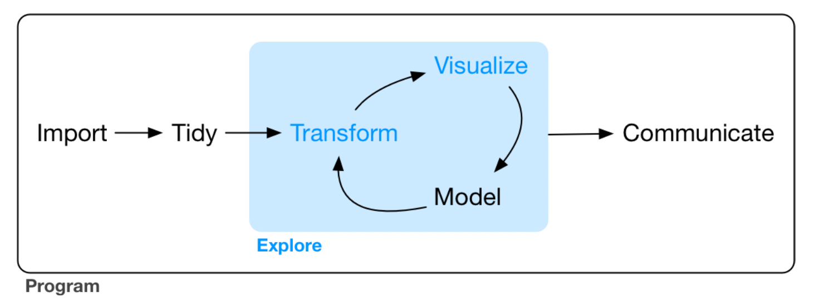

# (PART) 以 `tidyverse` 進行資料探索 {-}

# 以 `ggplot2` 進行資料視覺化 {#ggplot2}

:::{.note}
本部分（第 \@ref(ggplot2)、\@ref(dplyr)、\@ref(EDA) 章）要談的是資料探索。本章為 @wickhamDataScience2016 第 1 章內容。
:::

```{r dataexploring, fig.align = 'center', echo=FALSE, out.width="550", fig.cap="Data exploring."}

```

### 前置作業 {-}

此章的目的則是要學習以 `ggplot2` 進行簡單的資料視覺化。我們先要載入 `tidyverse`，其包含了 `ggplot2`。在 Console 輸入：

```{r}
library(tidyverse)
```

## 創建一個 `ggplot`  {#create}

>  引擎大的車子相較於引擎小的車子使用更多的汽油嗎？

我們可以使用 `tidyverse` 中 `mpg` 這個 data frame 來嘗試回答這個問題。

```{r}
mpg
```

其中，`displ` 為引擎的大小，單位是公升數；`hwy` 為汽車在高速公路上的燃油效率，以每加侖英里（miles per gallon, mpg）為單位，較低的話代表同樣的里程得要使用更多的油。

我們可以把 `displ` 放在 $x$ 軸，而把 `hwy` 放在 $y$ 軸，創建一個 `ggplot`：

```{r, fig.align = 'center', cache=TRUE}
ggplot(data = mpg) + geom_point(mapping = aes(x = displ, y = hwy))
```

`ggplot()` 可以創造一個座標系統，而我們可以在上面加上圖層。其中，第一個引數為此圖所要使用的 dataset，例如此處為 `ggplot(dataset=mpg)`，但這時候不會得到任何東西，只有一張空白的圖。而我們可以再加上其他圖層，如使用 `geom_point()`，可以用來繪製散佈圖（scatterplot）。而 `geom_point()` 函數有引數 `mapping`，與 `aes()` 搭配使用，可以讓我們指定 $x$ 軸與 $y$ 軸分別要是什麼變數。

此外，從此圖看起來，引擎大小與燃油效率呈現負向關係，即引擎更大的車，使用更多油。

## The Layered Grammar of Graphics

`ggplot2` 的語法大致如下，層層堆疊各種函數。在 geom 中，除了 `mapping=aes()`，我們還可以加上其他種類的 `stat` 與 "position adjustment"；若有需要，也可以加上不同的「座標系統」與 "facet function"。

```{r eval=FALSE, cache=TRUE}
ggplot(data = <DATA>) + 
  <GEOM_FUNCTION>(
    mapping = aes(<MAPPINGS>),
    stat = <STAT>,
    position = <POSITION>)+
    <COORDINATE_FUNCTION> +
    <FACET_FUNCTION>
```

以下將逐一簡介這些參數（以 `<>` 包圍的字串）的使用方式。

## Aesthetic Mappings

我們可以新增第三個變數，例如 `mpg` 中的 `class` 到兩向度的散佈圖，讓上面的點映射到 *aesthetic*。*Aesthetic* 是一種物件的視覺性質，包含了點的 color、size、shape 等。使用 *aesthetic* 在 `aes()` 中使用 `aesthetic.name = variable.name` 即可，而如果我們不想要旁邊的圖例，可以使用 `show.legend = FALSE`，如：

```{r, fig.align = 'center', cache=TRUE}
# ggplot(data = mpg) + 
#   geom_point(mapping = aes(x = displ, y = hwy, color = class), show.legend = FALSE)
ggplot(data = mpg) + geom_point(mapping = aes(x = displ, y = hwy, color = class))
```

此外，如果我們映射 `color` 到一個邏輯條件，則如：

```{r, fig.align='center', cache=TRUE}
ggplot(data = mpg) + geom_point(mapping = aes(x = displ, y = hwy, color = displ < 5))
```

我們也可以使用 `size = class`。但要注意的是此時會出現 `Warning`，因為把一個無序的變數 `class` 映射到一個有序的 aesthetic `size` 並不是一個好方法：

```{r, fig.align='center', cache=TRUE}
ggplot(data = mpg) + geom_point(mapping = aes(x = displ, y = hwy, size = class))
```

我們也可以映射 `class` 到 `alpha` 或 `shape`，分別代表透明度與形狀，但也都會出現 `Warning`：

```{r, fig.align='center', cache = TRUE}
ggplot(data = mpg) + geom_point(mapping = aes(x = displ, y = hwy, alpha = class))
```

```{r, fig.align='center', cache = TRUE}
ggplot(data = mpg) + geom_point(mapping = aes(x = displ, y = hwy, shape = class))
```


我們也可以從 `geom` 手動選擇 aesthetic properties，例如我們可以在 `geom()` 中加上 `color = "blue"`，讓所有點都變成藍色：

```{r, fig.align='center', cache = TRUE}
ggplot(data = mpg) + geom_point(mapping = aes(x = displ, y = hwy), color = "blue")
```

這樣的話，就只是改變顏色，顏色並未傳達更多資訊。不過，事實上 `ggplot2` 也可以手動設置 aesthetic，不過此處從略。

## Facets

>  注意：類別變數才能繪製成 facets！

除了把變數映射到 aesthetics，我們也可以把**類別變數**繪製成 facets，即分別繪製資料不同的子集。要繪製 facets，我們可以使用 `facet_wrap()`，其第一個引數是一個 formula，即 `~ 變數名稱`。此外，也可以 `nrow` 或 `ncol` 來指定要有幾個 rows 或 columns。如我們要根據 `class` 來繪製 facets，而排成兩個 rows 的形式，即：

```{r cache = TRUE, fig.align='center'}
ggplot(data = mpg) +
      geom_point(mapping = aes(x = displ, y = hwy)) +
      facet_wrap(~ class, nrow = 2)
```

如果我們要把 facets 畫成兩個變數的組合，那就必須使用 `facet_gird()`，其語法如 `facet_grid(row ~ col)`。以下的例子，因為 `drv` 共有三種值：`4`、`f`、`r`，而 `cyl` 共有四種值：`4`、`5`、`6`、`8`，所以：

```{r cache = TRUE, fig.align='center'}
ggplot(data = mpg) +
      geom_point(mapping = aes(x = displ, y = hwy)) +
      facet_grid(drv ~ cyl)
```

如果 row 或 column 其中一者不想要有變數，可以使用 `facet_grid()`。

## 幾何物件

*Geom* 是一種圖用來表示資料的幾何物件。例如，bar charts 使用 bar geoms，line charts 使用 line geoms，boxplots 使用 boxplot geoms 等。

要改變圖的 geom，即改變 `ggplot()` 所加的 geom function，例如我們把剛剛的 `geom_point()` 改成 `geom_smooth` 的話將會得到：

```{r, cache=TRUE, fig.align='center'}
# 對於 geom_smooth() 中的 method 與 formula 用法可見其文檔
ggplot(data = mpg) +
      geom_smooth(mapping = aes(x = displ, y = hwy), method = 'loess', formula = 'y ~ x')
```

我們也可以設置 aesthetic。雖然不能設置線的 shape，但可以設定線的 linetype。例如，我們可以根據變數 `drv` 來繪製三條不同的線：

```{r, fig.align='center', cache=TRUE}
ggplot(data = mpg) + 
  geom_smooth(mapping = aes(x = displ, y = hwy, linetype = drv),
              method = "loess", formula = "y ~ x")
```

或者也可以疊加兩種 geom：

```{r, fig.align='center', cache=TRUE}
ggplot(data = mpg) + 
  geom_smooth(mapping = aes(x = displ, y = hwy, color = drv, linetype = drv),
              method = "loess", formula = "y ~ x") + 
  geom_point(mapping = aes(x = displ, y = hwy, color = drv))
```

如果把引數放在 `ggplot()` 中，則會被視為 global mapping，將會套用到圖中的所有 geom；而放在 `geom()` 中則會被視為 local mapping，只會套用到該 geom。所以上述的程式碼也可以簡化為：

```{r, cache=TRUE, fig.align='center'}
ggplot(data = mpg, mapping = aes(x = displ, y = hwy, color = drv)) + 
  geom_smooth(aes(linetype = drv), method = "loess", formula = "y ~ x") + 
  geom_point()
```


## 統計轉換

`diamonds` 是 `ggplot2` 中的一個 dataset，約有 54000 顆鑽石的資料，包含 `carat`、`cut`、`color`、`clarity`、`depth`、`table`、`price` 等變數。使用 `geom_bar()` 可以依據某個變數畫出長條圖（bar chart），例如我們想要知道各種 cuts 到底有分別有多少鑽石，可以：

```{r, fig.align='center', cache=TRUE}
ggplot(data = diamonds) + geom_bar(mapping = aes(x = cut))
```

在此，$x$ 軸為 `cut`，是 `diamonds` 中的變數；$y$ 軸為 `count`，並非 `diamonds` 中的變數，而是自動計算在各個 `cut` 中鑽石的數量。某些圖會計算新的變數然，例如：

1.  長條圖、直方圖（histogram）或 frequency polygons 都會計算個數。
2.  Smoothers 會適配模型然後畫出預測。
3.  Boxplots 會計算分佈。

用來計算新的值的演算法稱之為 *stat*，為 statistical transformation 的簡稱。例如以 `?geom_bar` 查看 `geom_bar()` 的幫助頁面，會發現其使用 `stat_count()`。因為每個 geom 都有一個預設的 stat，反之亦然，所以我們可以把 geom 與 stat 交換使用。也因此，如果把上圖的 `geom_bar()` 換成 `stat_count()` 也會到相同的結果。

什麼時候需要明確地使用 stat 呢？

1.  想要替換預設的 stat 的時候。

2.  想要換原本的 mapping 時。

```{r, cache=TRUE, fig.align='center'}
ggplot(data = diamonds) +
  geom_bar(
    mapping = aes(x = cut, y = ..prop.., group = 1)
  )
```

3.  想要使用其他的 statistical transformation 的時候。例如使用 `stat_summary()`，其會對每個 `x` 都 summarizes 其 `y`。

```{r, cache=TRUE, fig.align='center'}
ggplot(data = diamonds) +
  stat_summary(
    mapping = aes(x = cut, y = depth),
    fun.min = min,
    fun.max = max,
    fun = median
  )
```


## Position Adjustment

想要為長條圖著色，除了使用 `color`，還可以使用 `fill`，兩者的效果也不同：

```{r, cache=TRUE, fig.align='center'}
ggplot(data = diamonds) +
  geom_bar(mapping = aes(x = cut, color = cut))
ggplot(data = diamonds) +
  geom_bar(mapping = aes(x = cut, fill = cut))
```

如果 `fill` 指定為另一個變數的話，就會自動變成「堆疊」的形式，如：

```{r, cache=TRUE, fig.align='center'}
ggplot(data = diamonds, mapping = aes(x = cut, fill = clarity)) + 
  geom_bar()
```

這種堆疊是透過位置調整（position adjustment）進行的。`position` 預設為 `position="stack"`，而我們還能把 `position` 指定成其他三種選項：`identity`、`dodge` 與 `fill`：

1.  `position = "identity"`：用在 bar chart 上效果有點像 `stack`，但差別在調整透明度後可以看出來（即 `alpha = 1/5`）；雖然還是不明顯，但差別在 `identity` 的各個物件是會相互堆疊的。例如在下圖中，調整透明度明明應該所有物件的透明度都相同，但越靠下的部分透明度顯然越低，這就是因為越靠下的部分有越多個物件重疊在一起，使得圖形顯得較不透明。

```{r, cache=TRUE, fig.align='center'}
ggplot(data = diamonds, mapping = aes(x = cut, fill = clarity)) +
  geom_bar(alpha = 1/5, position = "identity")
```

2.  `position = "fill"`：依據指定的變數（此數為 `clarity`）堆疊，差別在高度相同，所以便於我們比較組間的比例差別。

```{r, cache=TRUE, fig.align='center'}
ggplot(data = diamonds, mapping = aes(x = cut, fill = clarity)) +
  geom_bar(position = "fill")
```

3.  `position = "dodge"`：以此例而言，即是對於每個不同的 `cut`，都分別把其各個 `clarity` 展現在逐一呈現，而非用堆疊的方式。

```{r, cache=TRUE, fig.align='center'}
ggplot(data = diamonds, mapping = aes(x = cut, fill = clarity)) +
  geom_bar(position = "dodge")
```

此外，當然還有其他 `position` 的引數可用，例如 `position = "jitter"`，其在 bar chart 中沒什麼用，但在散佈圖中有大用。回憶節 \@ref(create) 的散佈圖：

```{r, fig.align = 'center', cache=TRUE}
ggplot(data = mpg) + geom_point(mapping = aes(x = displ, y = hwy))
```

事實上，`mpg` 明明有 234 個觀察值，如：

```{r, eval=FALSE}
str(mpg)
# tibble [234 × 11] (S3: tbl_df/tbl/data.frame)
# ...
```

但上面的散佈圖卻只有顯示 126 個點，為什麼？因為 **overplotting**！有些點的座標相同，所以相互覆蓋了。設置 `position = "jitter"` 可以解決這個問題，這會在每個點加入一點點 random noise，排除 overplotting 的問題。

```{r, cache=TRUE, fig.align='center'}
ggplot(data = mpg, mapping = aes(x = displ, y = hwy)) + 
  geom_point(position = "jitter")
```

## 座標系統 {#coordinatedsystem}

除了前面使用的笛卡兒座標系統，還有其他有用的座標系統：

1.  `coord_flip()`：繪製旋轉 90 度的直角坐標，如：

```{r, cache=TRUE, fig.align='center'}
ggplot(data = mpg, mapping = aes(x = class, y = hwy)) + geom_boxplot()
ggplot(data = mpg, mapping = aes(x = class, y = hwy)) + geom_boxplot() + coord_flip()
```

2.  `coord_quickmap()`：繪製有正確方位比例的地圖^[另有 `coord_map()`，功能與 `coord_quickmap()` 類似。`coord_map()` 預設使用[麥卡托投影法（Mercator projection）](https://zh.wikipedia.org/wiki/%E9%BA%A5%E5%8D%A1%E6%89%98%E6%8A%95%E5%BD%B1%E6%B3%95)。而兩者的差別在 `coord_quickmap` 為 `coord_map()` 的近似，忽略了地球在不同經緯度比例的曲度差異，因此運行速率較快，但也稍微不準確。]，如：


```{r, cache=TRUE, fig.align='center'}
nz <- map_data("nz")

ggplot(nz, aes(long, lat, group = group)) + 
  geom_polygon(fill = "white", color = "black")
ggplot(nz, aes(long, lat, group = group)) + 
  geom_polygon(fill = "white", color = "black") + coord_quickmap()
```


3.  `coord_polar()`：繪製極座標圖（polar coordinates），結合 bar char 與 Coxcomb chart，如：

```{r, cache=TRUE, fig.align='center'}
bar <- ggplot(data = diamonds) +
  geom_bar(mapping = aes(x = cut, fill = cut), show.legend = FALSE, width = 1) +
  theme(aspect.ratio = 1) + labs(x = NULL, y = NULL)

bar + coord_polar()
```

4.  `coord_fixed`：因為人對與 45 度線的差異感受最明顯，而 `coord_fixed()` 可以讓 `geom_abline()`（用以產生 reference lines 的 geom）產生的線為 45 度，如：

```{r, cache=TRUE, fig.align='center'}
p <- ggplot(data = mpg, mapping = aes(x = cty, y = hwy)) +
  geom_point() + geom_abline()

p + coord_fixed()  # 如果不加 coord_fixed()，比例將會跑掉。
```

## 標籤

`labs()` 能使我們為圖加上標題、註解或更改 `x` 軸、`y` 軸的名稱，如：

```{r cache=TRUE, fig.align='center'}
ggplot(data = mpg, mapping = aes(x = class, y = hwy)) + 
  geom_boxplot() + 
  coord_flip() +
  labs(y = "Highway MPG",
       x = "Class",
       title = "Highway MPG by car class",
       subtitle = "1999-2008",
       caption = "Source: http://fueleconomy.gov")
```