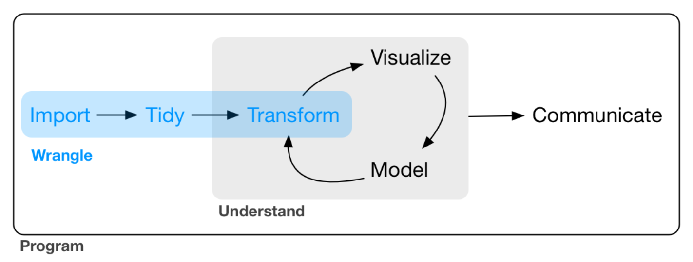

# (PART) 以 `tidyverse` 進行資料整理 {-}


# 以 `tibble` 處理 Tibbles {#tibble}

:::{.note}
本章為 @wickhamDataScience2016 第 7 章內容。
:::

本部分（第 \@ref(tibble)、\@ref(readr)、\@ref(tidyr)、\@ref(dplyr2)、\@ref(stringr)、\@ref(forcats)、\@ref(lubridate) 章）要談的是資料整理（data wrangling）。

```{r datawrangling, fig.align = 'center', echo=FALSE, out.width="550", fig.cap="Data wrangling."}

```


## 創建 Tibbles

### 把 Data Frames 轉換 Tibbles

Tibbles 也是一種 data frames。要把 data frames 轉換成 tibbles 很簡單，只要使用 `as_tibble()` 函數即可，如：

```{r, cache=TRUE}
as_tibble(iris)
```

### 透過向量創建 Tibbles

我們也可以透過向量來創建 tibbles，如：

```{r, cache=TRUE}
tibble(
  x = 1 : 5,
  y = 1,
  z = x ^ 2 + y
)
```

Tibbles 的 column 還可以取名為本來在 base R 的語法中不合法的變數名稱，即 nonsynaptic names，例如非字母開頭或者有特殊字元或空格，只要用兩個 `\` 包圍即可，而要使用這些變數的話同樣要以 `\` 來包圍，如：

```{r, cache=TRUE}
tibble(
  ` ` = 1 : 3,
  `:)` = 1,
  `2049` = ` ` ^ 2 + `:)`
)
```

### 以 Transposed Tibble `tribble()` 創建 Tibbles

我們也可以 `tribble()`，即 transposed tribble 來創建 tibbles。使用 `tribble()` 的方式如下：

```{r, cache=TRUE}
tribble(
  ~x, ~y, ~z,
  #--/--/----
  "a", 2, 3.4,
  "s", 4, NA
)
```

事實上，`#--/--/----` 並非必須的（也只是一個註解），但便於我們辨識變數與變數值。


## Tibbles 與 Data Frames 的比較

### Printing

```{r, cache=TRUE}
tibble(
  a = lubridate::now() + runif(1e3) * 86400,
  b = lubridate::today() + runif(1e3) * 30,
  c = 1:1e3,
  d = runif(1e3),
  e = sample(letters, 1e3, replace = TRUE)
)
```

印出 tibbles 時，預設只會印出前 10 個 rows，而每個 column 之下都會印出其型態。

那如果我們想要同時看到更多觀察值怎麼辦？有以下幾種做法：

1. 使用 `print()`，決定要印出多少 rows 與 columns；其中，`n = 2` 代表印出 2 個 rows，而 `width = Inf` 代表印出所有 columns，如：

```{r, cache=TRUE}
nycflights13::flights %>%
  print(n = 2, width = Inf)
```

2. 或者使用 `options(tibble.print_max = n, tibble.print_min = m)`：如果有超過 `m` 個 rows，則只印出 `n` 個 rows。所以如果 `tibble.print_min` 設置為 `Inf` 則會印出所有的 rows；而 `options(tibble.width = Inf)` 會印出所有的 columns。

3. 使用 `View()`，最容易閱讀的方式。


### Subsetting

如果我們要取出 tibble 的某個變數，我們需要使用 `$` 與 `[[`，前者可以使我們取出指定的變數名稱的變數；後者除了可以使我們取出指定的變數名稱的變數以外，還能取出指定位置的變數，如新增一個 tibble：

```{r, cache=TRUE, eval=FALSE}
df <- tibble(
  x = runif(5),  # x 為均勻分配的 5 個數字
  y = rnorm(5)   # y 為常態分配的 5 個數字
)
```

```{r, cache=TRUE, eval=FALSE}
# Extract by name
df$x  # [1] 0.1552525 0.2570212 0.2929349 0.7355940 0.3282747
df[["x"]]  # [1] 0.1552525 0.2570212 0.2929349 0.7355940 0.3282747

# Extract by position
df[[1]]  # [1] 0.1552525 0.2570212 0.2929349 0.7355940 0.3282747
```

想要在此時使用 pipe 的話要記得加上 `.`，如：

```{r, cache=TRUE, eval=FALSE}
df %>% .$x  # [1] 0.1552525 0.2570212 0.2929349 0.7355940 0.3282747
df %>% .[["x"]]  # [1] 0.1552525 0.2570212 0.2929349 0.7355940 0.3282747
```


## 古老的程式碼

有些古老的函數無法使用 tibble，這時候我們需要使用 `as.data.frame()` 將 tibble 轉換回 data frame。如果 tibble 不相容於某古老的函數，那很有可能是因為 `[`（即 subsetting）的函數。在 `tidyverse` 中，多半可以不用 `[`，而透過 `dplyr::filter()` 與 `dplyr::select()` 來達到類似的結果。此外，在 base R 中，使用 `[` 有時候會回傳一個 data frame，而有時會回傳一個向量；不過在 tibbles 中，使用 `[` 都會回傳 tibble。