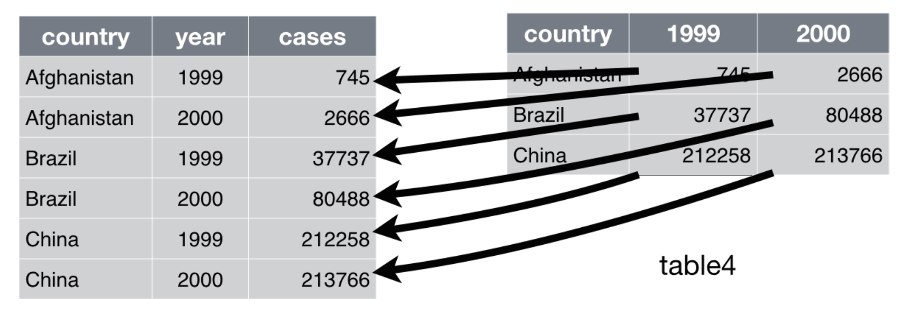
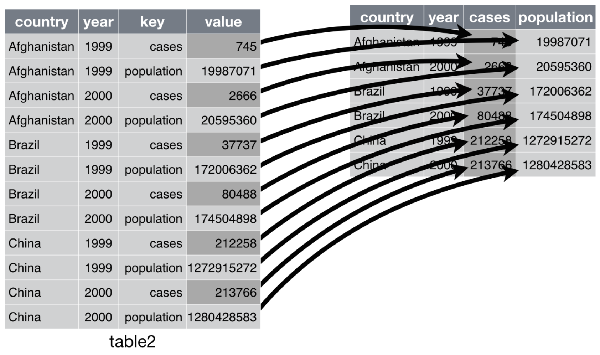
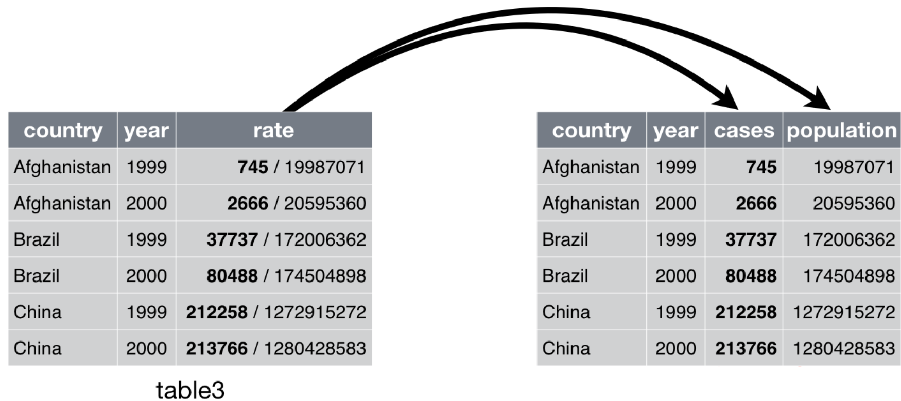
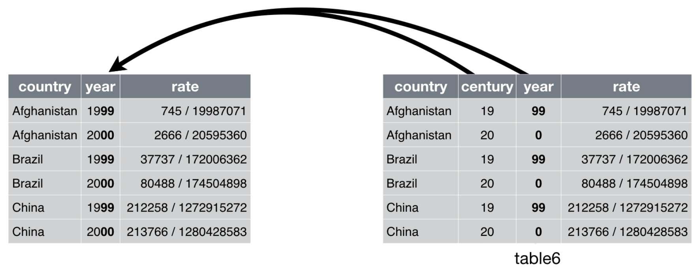

# 以 `tidyr` 整理資料 {#tidyr}

:::{.note}
本章為 @wickhamDataScience2016 第 9 章內容。另外可參見 @wickham2014tidy 作為本章補充。
:::

> Happy families are all alike; every unhappy family is unhappy in its own way.
> 
> --- Leo Tolstoy

> Tidy datasets are all alike, but every messy dataset is messy in its own way.
> 
> --- Hadley Wickham

### 需要的套件 {-}

```{r}
library(tidyverse)
```

## Tidy Data

:::{.comment}
一筆**整潔的**資料有三個彼此相關的規則：

1.  每個變數都自成一行。
2.  每個觀察值都自成一列。
3.  每個變數值都自成一格。

因此，我們要做的事情就是：

1.  把每筆資料都放在一個 tibble 中。
2.  把每個變數都放在一行中。
:::

以下有五筆資料，每筆都是相同的，但是只有 `table1` 是整潔的（tidy）的：

```{r, cache=TRUE}
table1
table2
table3
table4a
table4b
```

事實上，因為 `dplyr` 與 `ggplot2`，以及所有 `tidyverse` 的套件，甚至是多數的 R 套件都是為 tidy data 所設計，因此這個環節至關重要。

:::{.comment}
不過，有時候 nontidy data 也有其用處。例如可能效能較好，或佔據的空間更小；或者某些專業領域有其儲存資料的特殊傳統。詳情可以參見 [Non-tidy data](https://simplystatistics.org/2016/02/17/non-tidy-data/)。
:::

## Spreading and Gathering

:::{.comment}
不整潔的資料，有兩類常見的問題：

-  一個變數存在多行中。
-  一個觀察值分散在好幾列中。

想要解決這兩種問題，我們可以使用 `tidyr` 所提供的 `gather()` 與 `spread()` 函數。
:::

### Gathering

以剛剛展示過的 `table4a` 而言，它**行的名稱不是變數的名稱**：

```{r, cache=TRUE}
table4a
```

要整理這批資料，我們需要三種參數：

-  應該要是變數值而不是變數的行，即 `1999` 和 `2000`。

-  其值原本是行的名稱的新變數名稱，這裡將有變數值為 `1999` 和 `2000` 的變數稱為 `year`，搭配引數 `key`。

-  其值原本散落在格子內的新變數名稱，這裡稱呼為 `cases`，搭配引數 `value`。

所以，我們可以如此整理 `table4a`：

```{r, cache=TRUE}
table4a %>%
  gather(`1999`, `2000`, key = "year", value = "cases")
```

```{r, fig.align='center', fig.cap="`gather()` 的運作方式。", out.width='550', echo=FALSE}

```

我們可以依樣畫葫蘆地整理 `table4b`：

```{r, cache=TRUE}
table4b %>%
  gather(`1999`, `2000`, key = "year", value = "population")
```

接下來，我們可以利用第 \@ref(dplyr2) 章會學到的 `dplyr::left_join()` 來合併這兩者：

```{r, cache=TRUE, message=FALSE}
tidy4a <- table4a %>%
  gather(`1999`, `2000`, key = "year", value = "cases")
tidy4b <- table4b %>%
  gather(`1999`, `2000`, key = "year", value = "population")
left_join(tidy4a, tidy4b)
```


### Spreading

Spreading 與 gathering 恰好相反，所要處理的問題是**觀察值分散在不同列裏**，`table2` 就有這樣的問題：

```{r, cache=TRUE}
table2
```

要處理這種問題，我們需要兩種參數：

-  包含變數名稱的行，此處即 `type`，搭配引數 `key`。

-  包含組成多個變數的變數值的行，此處即 `count`，搭配引數 `value`。

```{r, cache=TRUE}
table2 %>%
  spread(key = type, value = count)
```

```{r, fig.align='center', fig.cap="`spread()` 的運作方式。", out.width='550', echo=FALSE}

```


## Separating and Pull

:::{.comment}
另外兩種問題是**一行中有多個變數**與**一個變數分散在多行**，我們可以使用 `separate()` 與 `unite()` 來解決這兩種問題。
:::

### Seperate

`table3` 的問題就在有一行 `rate`，事實上裝了兩個變數：

```{r, cache=TRUE}
table3
```

只要有分隔字元的話，seperate 可以把一行拉成兩行，如：

```{r, cache=TRUE}
table3 %>%
  separate(rate, into = c("cases", "population"))
```
```{r, fig.align='center', fig.cap="`separate()` 的運作方式。", out.width='550', echo=FALSE}

```

`separate()` 預設會將非數字或字母的字元當成分隔字元，然後拆開。不過，如果有特殊的需求，我們也可以引數 `sep` 來手動指定分隔符號，如：

```{r, eval=FALSE}
table3 %>%
  separate(rate, into = c("cases", "population"), sep = "/")
```

`sep` 引數也不見得要丟入符號。我們可以在 `sep` 丟入數字，正值代表從字串左邊數來第 $n$ 個處分隔，負值則為從右邊數來第 $n$ 個處分隔，如：

```{r, cache=TRUE}
table3 %>%
  separate(year, into = c("century", "year"), sep = 2)
```

不過，事情還沒有結束。注意到上面的 `cases` 與 `population`，本應是數字，卻被記為字元。我們可以使用引數 `convert` 解決此問題：

```{r, cache=TRUE}
table3 %>%
  separate(
    rate,
    into = c("cases", "population"),
    convert = TRUE
)
```

### Unite

`unite()` 與 `separate()` 恰好相反，即把數行合併成一行。我們可以把 `table5` 的 `century` 與 `year` 兩行合併成 `new`，其中還可以加上引數 `sep`，因為 `unite()` 合併時預設會加入 `_`，因此我們必須設置為 `sep = ""`，如：

```{r, cache=TRUE}
table5
```

```{r, cache=TRUE}
table5 %>%
  unite(new, century, year, sep = "")
```

```{r, fig.align='center', fig.cap="`unite()` 的運作方式。", out.width='550', echo=FALSE}

```


## Missing Values


:::{.comment}
資料裡的缺漏值有兩種呈現形式：

1.  **Explicit.** 以 `NA` 表示。
2.  **Implicit.** 單純地沒有紀錄變數值。
:::

```{r, cache=TRUE}
stocks <- tibble(
  year   = c(2015, 2015, 2015, 2015, 2016, 2016, 2016),
  qtr    = c(   1,    2,    3,    4,    2,    3,    4),
  return = c(1.88, 0.59, 0.35,   NA, 0.92, 0.17, 2.66))
```

在以上的資料中，有兩個缺漏值：

1.  2015 年的第四季的報酬為 `NA`（explicit）。

2.  少了 2016 年第一季的資料（implicit）。

### 讓潛藏的缺漏值顯露出來

要如何讓潛藏的缺漏值顯露出來呢？

1.  使用 `spread()` 把 `year` 放到 column 去，再使用 `gather()` 把行的名稱變成變數的名稱，如：

    ```{r, cache=TRUE}
    stocks %>%
      spread(year, return) %>%
      gather(year, return, `2015`:`2016`, na.rm = FALSE)
    ```
    
2.  使用 `complete()`，如：

    ```{r, cache=TRUE}
    stocks %>%
      complete(year, qtr)
    ```

### 自動填入


```{r, cache=TRUE}
treatment <- tribble(
  ~ person,           ~ treatment, ~response,
  "Derrick Whitmore", 1,            7,
  NA,                 2,            10,
  NA,                 3,            9,
  "Katherine Burke",  1,            4
)
```

使用 `fill()` 會自動填入最常見的非缺漏值：

```{r}
treatment %>%
  fill(person)
```

