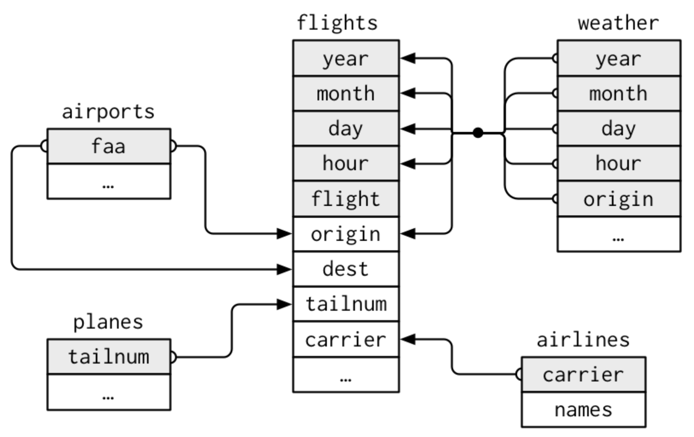

# 以 `dplyr` 處理關聯性資料 {#dplyr2}

:::{.note}
本章為 @wickhamDataScience2016 第 10 章內容。第 \@ref(dplyr) 章介紹了 `dplyr` 基本的操作，本章則要再延伸，介紹如何以 `dplyr` 處理**關聯性資料（relational data）**。一筆資料可能由好幾個表格組成，之所以被稱為關聯性資料，即**每一對**表格之間定義了**關係（relations）**
:::

:::{.caution}
本章尚未完成。
:::

### 需要的套件 {-}

```{r, cache=TRUE}
library(tidyverse)
library(nycflights13)
```

:::{.comment}
以 `dplyr` 處理關聯性資料有以下幾種操作：

-  **Mutating joins**: 從另一個表格所配對的觀察值添加新的變數到表格。
-  **Filtering joins**: 依據觀察值是否能配對到另一個表格來篩選觀察值。
-  **Set operations**: 把觀察值當作集合元素一般運算。

事實上，也有專門處理關聯性資料的關聯性資料庫管理系統（relational database management system, RDBMS），SQL 即一種關聯性資料庫語言。儘管 SQL 有更多功能，但 `dplyr` 在處理用以資料分析的關聯性資料時會方便於 SQL。
:::

## `nycflights13`

`nycflights13` 包含了與 `flights` 關聯的四個 tibbles，如圖 \@ref(fig:nycflights13) 與如下：

-  `airlines`：所有航空公司及其縮寫。

    ```{r, cache=TRUE}
    airlines
    ```
    
-  `airports`：所有機場及其地點與縮寫。

    ```{r, cache=TRUE}
    airports
    ```
    
-  `planes`：所有飛機與其代號。

    ```{r, cache=TRUE}
    planes
    ```
    
-  `weather`：NYC 每小時的天氣。

    ```{r, cache=TRUE}
    weather
    ```
    

```{r nycflights13, cache=TRUE, fig.align='center', fig.cap="關聯性資料。", out.width="550", echo=FALSE}

```

:::{.comment}
根據圖 \@ref(fig:nycflights13) 可知：

-  `flights` 透過變數 `carrier` 與 `airlines` 連接。
-  `flights` 透過變數 `origin` 及 `dest` 與 `airports` 連接。
-  `flights` 透過變數 `tailnum` 與 `planes` 連接。
-  `flights` 透過變數 `origin`、`year`、`month`、`day` 及 `hour` 與 `weather` 連接。
:::


## Keys

:::{.comment}
Keys 為連接一對表格的變數。Keys 有兩種類型：

1. **Primary key**: Uniquely identifies an observation in its own table.
2. **Foreign key**: Uniquely identifies an observation in another table.

例如 `planes$tailnum` 就是 primary key；而 `flights$tailnum` 則是 foreign key。當然，變數可以同時是 primary key 與 foreign key；如 `origin` 是 `weather` 的 primary key，又是 `airport` 的 foreign key。 
:::

識別了表格中的 primary key 以後， 我們可以確認看看是否他們唯一地識別了每個觀察值。我們可以利用 `count()` 來計算 primary keys，然後看看 `n` 有沒有大於 1，如：

```{r, cache=TRUE}
planes %>%
  count(tailnum) %>%
  filter(n > 1)

weather %>%
  count(year, month, day, hour, origin) %>%
  filter(n > 1)
```


## Mutating Joins

## Filtering joins

## Join Problems

## Set operations


:::{.comment}
集合運算很少使用，但當我們想要把單一個複雜的 filter 拆解成多個簡單的部分時，集合運算可以幫上大忙。假設 `x` 與 `y` 有相同的變數，集合運算有三種：

-  `intersect(x, y)`: 回傳 `x` 與 `y` 的觀察值的交集。
-  `union(x, y)`: 回傳 `x` 或 `y` 的觀察值的聯集。
-  `setdiff(x, y)`: 回傳 `x` 的觀察值，但要扣除 `y` 也有的。
:::