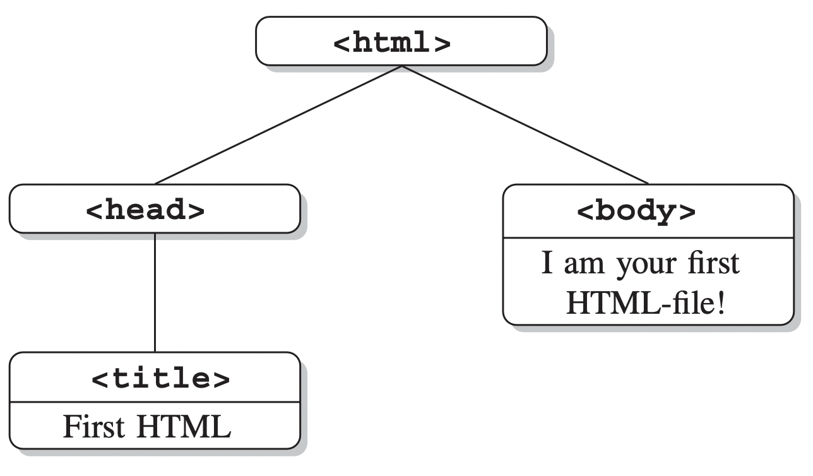

# (PART) 網路與資料技術入門 {.unnumbered}

# HTML

-  本章為 @munzertAutomatedDataCollection2014 第 2 章內容。

---

HTML 為 the **H**yper**T**ext **M**arkup **L**anguage 的縮寫。

-   在節 \@ref(sourcecode)，將會使用瀏覽器呈現網頁原始碼（source code），並查看特定的 HTML 元素。

-   在節 \@ref(htmlsyntax)，將會介紹標記語言的邏輯與 HTML 的語法規則。

-   在節 \@ref(tagsattri)，將會呈現 HTML 最重要的詞彙。

-   在節 \@ref(parsing)，將會討論重構 HTML 結構及語法的過程，即**解析（parsing）**，與其如何幫助我們從網頁文檔提取資訊。

## 瀏覽器呈現與原始碼 {#sourcecode}

HTML 檔為純文字檔（plain text file）。HTML markup 可以用來定義文檔哪些部分該是標題、連結、表格，或其他格式。這些標記會告訴瀏覽器文檔如何組織，與其各部分的功能。

我們在網頁瀏覽器中所看到過的是轉譯過的 HTML 檔，例如網頁 <http://www.r-datacollection.com/materials/html/OurFirstHTML.html> ，呈現在我們眼前的是一句話："I am your first HTML-file!"，而實際上有如此的原始碼：

``` {.html}
<!DOCTYPE html>
 <html>
   <head>
     <title>First HTML</title>  <!-- 此網頁的 title -->  
   </head>
   <body>
     I am your first HTML-file!
   </body>
 </html>
```

## 語法規則 {#htmlsyntax}

### 標籤、元素與屬性

透過可以被瀏覽器讀懂的**標籤（tags）**，純文字檔可以變成 HTML 文件。

標籤由 `<` 與 `>` 包著，分成兩種，其一為 start tags，又稱為 opening tags，例如 `<title>`；其二為 end tags，又稱為 closing tags，與 start tags 不同的是多了 `/`，如 `</title>`。

**元素（elements）**則包含 start tags、contents 與 end tags，[^html-1]如：

[^html-1]: 不過標籤與元素常常被當成同義詞就是了，以後我們也會這麼做。

``` {.html}
<title>First HTML</title>
```

不過，並非所有的元素都會有一個 start tag 與一個 end tag。例如 `<br>` 意思是換行，就不會有另一個 `</br>` 為 end tag。如果元素形為 `<body/>`，在 start tag 中就以 `/` 結束，則稱為**空元素**，因為沒有任何 content。HTML 的標籤的大小寫並不重要，因此 `<tagNAME>`、`<TAGNAME>` 或 `<tagname>` 都是等價的，但一般我們會寫成全部都是小寫的形式。

此外，標籤還有一特色為**屬性（attributes）**，通常放在 start tag 的標籤名稱之後。一個屬性會有一個屬性名稱與一個值，例如：

``` {.html}
<a href="http://www.r-datacollection.com/">Link to Homepage</a>
```

其中的 `href="http://www.r-datacollection.com/"`就是指定 anchor `<a>` 的屬性，而 `href` 就是屬性名稱，以單引號或雙引號包著的 `"http://www.r-datacollection.com/"` 即是屬性的值。標籤也能有多個屬性，只要用空格隔開即可。

### 樹結構

``` {.html}
<!DOCTYPE html>
 <html>
   <head>
     <title>First HTML</title>
   </head>
   <body>
     I am your first HTML-file!
   </body>
 </html>
```

以上述範例而言，`html` 包著 `<head>` 與 `<body>`，`<head>` 則包著 `<title>`，就像**樹結構（tree structure）**一樣，如圖 \@ref(fig:treestructure)。

```{r treestructure, echo=FALSE, out.width="400", fig.align='center', fig.cap="樹結構。"}

```

### 註釋

HTML 可以加入**註釋（comments）**，以 `<!--` 開頭，`-->` 結尾，中間的文字會被忽略，不會被呈現在瀏覽器上，如：

``` {.html}
<!-- Hi, I am a comment.
I can span several lines and I am able to store additional
  content that is not displayed by the browser. -->
```

### 保留與特殊字元

> HTML 的標籤使用 `<` 與 `>`，那我們要在正文使用 \< 或 \> 時怎麼辦？

對於這些會在 HTML 語法中使用的字元，如果要在 content 中使用它們，就要透過對應的 **character entities**。Entities 以 `&` 開頭，以 `;` 結尾。例如，如果我們希望瀏覽器可以顯示 "5 < 6 but 7 > 3"，不應該使用
```{.html}
<p>5 < 6 but 7 > 3 </p>
```

而應該使用

```{.html}
<p>5 &lt; 6 but 7 &gt; 3 </p>
```

<div align="center">
+------+---------------+-------------+---------------------+
| 字元 | Entity number | Entity name | 意思                |
+======+===============+=============+=====================+
| "    | `&#34;`       | `&quot;`    | quotation mark      |
+------+---------------+-------------+---------------------+
| '    | `&#39;`       | `&apos;`    | apostrophe          |
+------+---------------+-------------+---------------------+
| &    | `&#38;`       | `&amp;`     | ampersand           |
+------+---------------+-------------+---------------------+
| \<   | `&#60;`       | `&lt;`      | less than           |
+------+---------------+-------------+---------------------+
| \>   | `&#62;`       | `&gt;`      | greater than        |
+------+---------------+-------------+---------------------+
|      | `&#160;`      | `&nbsp;`    | non-breaking space  |
+------+---------------+-------------+---------------------+
| á    | `&#224;`      | `&agrave;`  | a with grave accent |
+------+---------------+-------------+---------------------+
| ♡    | `&#224;`      | `&hearts;`  | heart               |
+------+---------------+-------------+---------------------+

Table: (\#tab:htmlentities) HTML entities.
</div>


### 文件類型定義

### 空白與換行

## 標籤與屬性 {#tagsattri}

### The anchor tag `<a>`

### The metadata tag `<meta>`

### The external reference tag `<link>`

### Emphasizing tags `<b>`, `<i>`, `<strong>`

### The paragraphs tag `<p>`

### Heading tags `<h1>`, `<h2>`, `<h3>`,...

### Listing content with `<ul>`, `<ol>`, and `<dl>`

### The organizational tags `<div>` and `<span>`

### The `<form>` tag and its companions

### The foreign script tag `<script>`

### Table tags `<table>`, `<tr>`, `<td>`, and `<th>`

## 解析 {#parsing}

### Discarding nodes

### 提取資訊
